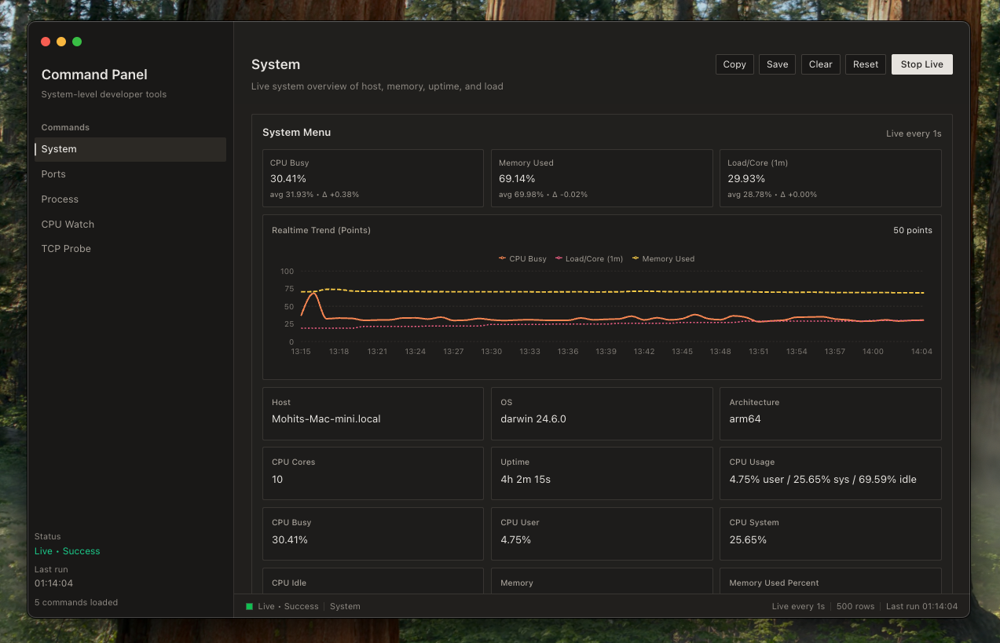

# 📊 YAAM - Yet Another Activity Monitor



**The world has enough activity monitors. Here is another one.**


---

## What Is This?

A simple activity monitor. It shows you what is running on your machine, what is hogging CPU, what is eating memory, and what probably should not be there.

No fancy dashboards. Just processes and numbers.

---

## Honest Disclaimer

> **This app is 100% vibe coded.**

I had never touched Electron before writing this. If the source code confuses you, same. If something breaks for no clear reason, expected.

It runs. It shows processes. You can kill them. Good enough.

---

## Features

- 📈 CPU and memory usage, live
- 🔍 Search through running processes
- 🚀 Not as slow as you would expect

---

## Platform Support

| Platform | Status |
|----------|--------|
| macOS    | 🚧 |
| Windows  | 🚧 |
| Linux    | 🚧 |

Cross-platform support is a work in progress. If you know Electron, you already know more than I did when I started.

---

## Getting Started

```bash
npm install
npm start
```

Works? Great. Does not work? Restart it. Still broken? Open an issue. We will figure it out together.

---

## Contributing

PRs are welcome. Refactors, fixes, performance work, all of it. If you spot something dumb, feel free to make it less dumb.

---

Built with curiosity, shaky confidence, and a lot of "wait, why did that work?"